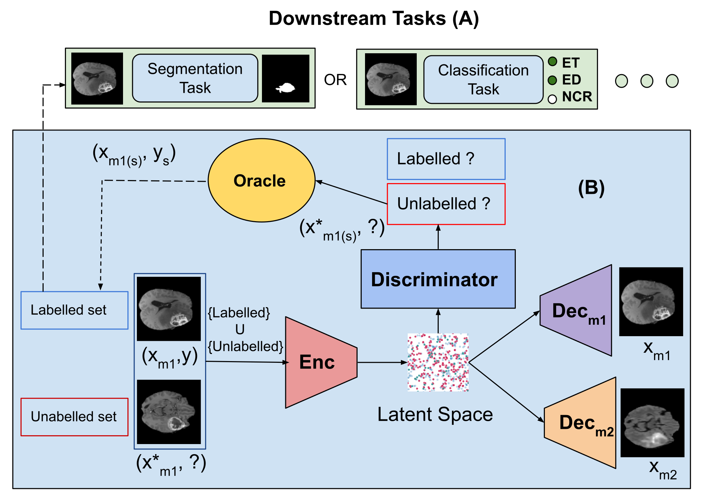
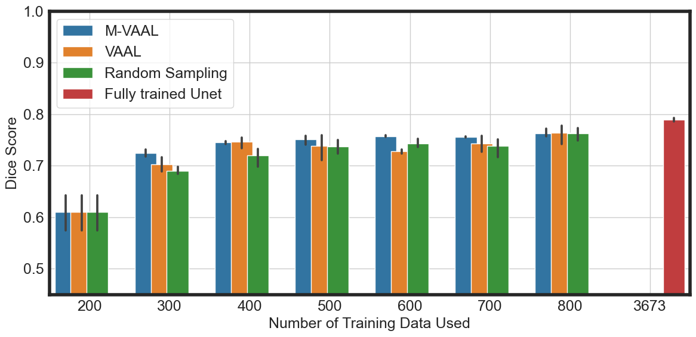
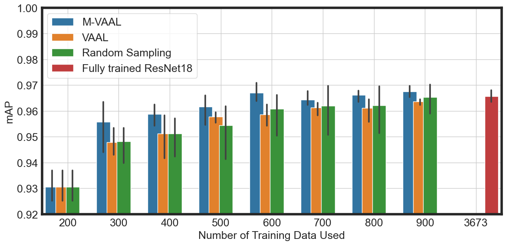
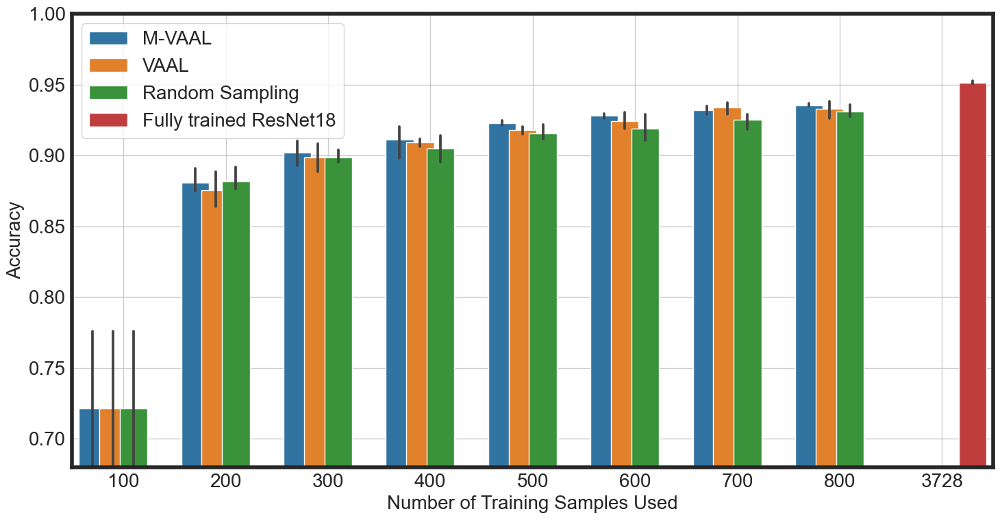
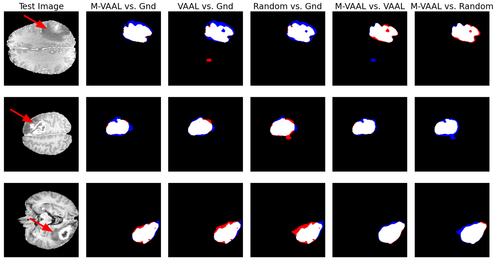

# MVAAL-medical-images
In this work, we present a task-agnostic Multimodal Variational Aversarial Active Learning (M-VAAL) for sampling the most informative samples for annotation in various Medical Image Analysis Downstream tasks, such as segmentation, and classification.

## Active Learning Pipeline
Our method modified task-agnostic [VAAL](https://github.com/sinhasam/vaal) framework to enable the use of multi-modal information in the active learning sampling phase.



### Installation
The required Python3 packages can be installed using 
```
conda config --add channels conda-forge
conda create -n <environment-name> --file requirements.txt
```

### Datasets 
We experiments with 210 High-Grade Gliomas [BraTS2018](https://www.kaggle.com/datasets/sanglequang/brats2018?select=MICCAI_BraTS_2018_Data_Training) and [COVID-QU-Ex](https://www.kaggle.com/datasets/cf77495622971312010dd5934ee91f07ccbcfdea8e2f7778977ea8485c1914df?select=Infection+Segmentation+Data) (COVID-19 infection
segmentation)   datasets. Data preprocessing steps are shown in BRATS_dataset_creator.ipynb and covid_visualizer.ipynb


### Experiments
To run the code use:
```
python3 main.py --dataset <Dataset> --expt <Experiment Name> --method <Sampling Method> --task_type <Downstream task, e.g: segmentation>
```

In our paper, we used the following combination of arguments:
```
--dataset brats_MIUA_HGG_3channel_classification --task_type multi_label_classification 
--dataset brats_MIUA_HGG_3channel --task_type segmentation
--dataset COVID_dataset_3_classes --task_type multi_class_classification

```

There are several hyperparameters that need to properly tunned to optimize the performance of M-VAAL and VAAL. These parameters are sensitive to dataset and task type.
```
--adversary_param --latent_dim --beta --num_vae_steps and --num_adv_steps --mse_gamma2 --alpha1 --alpha2
```


### Results

We compared M-VAAL against VAAL and randomsampling three downstream tasks: tumor segmentation, multi-label tumor type classification, and multi-class chest-Xray Infection classifcation.
<p align="center">
<br>
BraTS Whole Tumor Segmentation
</p>

<p align="center">
<br>
BraTS Tumor Type Multi-Label Classification
</p>

<p align="center">
<br>
Chest X-ray Multi-Class classification
</p>

#### Qualitative Results
<p align="center">
<br>
</p>

White denotes the region overlapped between two segmentation maps, blue denotes the region missed by the first method compared to second, and red denotes the region added by the first method. 


This work has been accepted at 27th Conference on Medical Image Understanding and Analysis 2023. Please use the following bibtex to cite our [paper](https://arxiv.org/abs/2306.12376).

```
@article{khanal2023m,
  title={M-VAAL: Multimodal Variational Adversarial Active Learning for Downstream Medical Image Analysis Tasks},
  author={Khanal, Bidur and Bhattarai, Binod and Khanal, Bishesh and Stoyanov, Danail and Linte, Cristian A},
  journal={arXiv preprint arXiv:2306.12376},
  year={2023}
}
```


